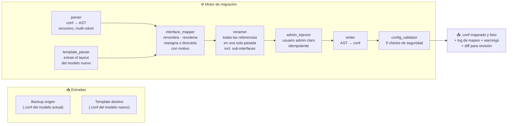

# 🔄 Cambio de Equipo entre FortiGate — Migrador de Backups

Herramienta que migra el **backup `.conf` de un FortiGate a otro modelo** (ej. 80F → 100F,
100F → 60F) ajustando automáticamente las interfaces físicas y conservando todas las
referencias. Funciona con **cualquier modelo FortiGate actual o futuro**: usa el backup
del equipo destino como plantilla — nada de catálogos hardcoded.

El flujo completo en un diagrama:



> En GitHub este diagrama se dibuja solo (Mermaid nativo). Si lo leés en texto
> plano: backup origen + template destino entran al motor (parser → mapper →
> renamer → admin injector → writer → validator) y salen un `.conf` mapeado y
> listo, con su log de mapeo, warnings y diff para que revises antes de subirlo
> al equipo nuevo.

## Cómo funciona

1. Cargás el **backup origen** (el `.conf` del modelo actual) y el **backup destino**
   (una template `.conf` del modelo al que querés pasar).
2. La app detecta el modelo de origen (`#config-version=`) y extrae el **layout de
   interfaces del destino** (puertos `portN`, `wan1..N`, `dmz`, `mgmt`, `ha1/ha2`,
   `modem`, y cualquier interfaz física no-canónica) desde la plantilla.
3. El motor:
   - **Renombra** interfaces: `internal` ⇄ `port`, `LAN` → nombre canónico del destino,
     con reescritura en **una sola pasada** (sin corrupción de encadenados
     `wan3→port4→port5`), incluyendo **sub-interfaces** (`port1.100` ⇄ `port2.100`).
   - **Descarta con aviso** lo que el destino no tiene (motivo explícito por interfaz,
     ej. "destino solo admite 6 puertos LAN"), y **crea vacíos** los slots nuevos.
   - **Reasigna** excedentes: automático (por prioridad wan < dmz < ha < mgmt < modem < lan)
     o **manual, a cualquier tipo de slot** (wan/dmz/mgmt/ha/modem incluidos).
   - **Renombra todas las referencias**: firewall policies, static routes, VPN/IPsec,
     DHCP servers, zones, aggregate/link-monitor members — y verifica que no queden
     **huérfanas** (con ignorancia correcta de macros `$(VDOM_LINKS)`, `*`, `any`).
   - **Inyecta** (opcional) el usuario admin `claro` en `config system admin`,
     idempotente, avisando si el perfil `super_admin` no existe en la plantilla.
   - **Valida** el output: balance de bloques, edits duplicados, configs incompletos
     (matching por token exacto), referencias a interfaces inexistentes.
4. Revisás el log de mapeo, warnings y diff, y descargás el `.conf` para restauraren el equipo nuevo.

## Estructura

```
CAMBIO DE EQUIPO AUTOMATIZACION/
├── app/
│   ├── iniciar.bat              # Lanzador → http://localhost:8765
│   ├── main.py                  # Entry point Python
│   ├── server/app.py            # Servidor HTTP local + API /api/*
│   ├── core/                    # Motor de migración
│   │   ├── parser.py              # .conf → AST lossless (recursivo, soporta multi-vdom)
│   │   ├── template_parser.py     # backup destino → DestinationLayout
│   │   ├── interface_mapper.py    # mapeo + reasignación + descartes razonados
│   │   ├── renamer.py             # renombrado en una sola pasada + orphans
│   │   ├── admin_injector.py      # usuario admin 'claro' idempotente
│   │   ├── config_validator.py    # validación de output
│   │   ├── model_detector.py      # modelon desde #config-version=
│   │   ├── engine.py              # orquestador (run_pipeline)
│   │   └── ...                    # interface_classifier, interface_mapper helpers
│   ├── web/                     # UI (HTML/CSS/JS nativo, sin build)
│   ├── config/models.json       # referencia histórica de modelos comunes
│   └── tests/unit/              # 61 tests (suite unittest)
├── playwright-tests/            # E2E (spec + config, requiere npx playwright)
└── AGENTS.md                    # brief original del proyecto
```

**No se versiona** (`.gitignore`): `node_modules/`, artifacts de Playwright (traces,
screenshots), outputs generados (`output_*.conf`) y tus **backups de ejemplo locales**
(`Ejemplo_*.conf`). Los cargás vos en la UI — no subas backups reales de producción
al repo.

## Arranque

```powershell
# Doble clic en app\iniciar.bat, o:
& "$env:LOCALAPPDATA\Microsoft\WindowsApps\python.exe" app\server\app.py 8765
```

Se abre `http://localhost:8765` automáticamente. Sin dependencias externas: solo
**Python 3.11+ stdlib** (probado en 3.14).

| Tarea | Cómo |
|---|---|
| Levantar la UI | `app\iniciar.bat` |
| Correr la suite de tests | `python -m unittest discover -s tests` (desde `app/`) |
| E2E con Playwright | `npx playwright test` (desde `playwright-tests/`) |

## API

| Endpoint | Descripción |
|---|---|
| `POST /api/preview-template` | Extrae y muestra el layout de la plantilla destino |
| `POST /api/dry-run` | Corre el pipeline sin escribir salida (validación previa) |
| `POST /api/process` | Migración completa; devuelve mapeo + warnings + diff |
| `POST /api/download` | Descarga del `.conf` generado |
| `GET /sample/<name>.conf` | Sirve cualquier `.conf` que dejes en la raíz del proyecto |
| `GET /api/health` | Health check |

## Notas de diseño

- **Modelo-agnóstico por diseño**: el layout del modelo destino se aprende de su
  backup, no de una tabla. Un modelo futuro solo requiere su backup como template.
- **Reasignación manual guiada por la herramienta**: si una interfaz del origen no
  tiene lugar en el destino (ej. pasar a un modelo con menos puertos), la UI propone
  reasignarlas a slots libres (cualquier tipo) o descartarlas con motivo — nada se
  pierde en silencio.
- **Multi-vdom**: backups con `config vdom`/`edit root` se procesan igualmente (el
  parser busca configs anidados recursivamente).
- **`x1`/`x2`, port13-14 discartes**: al pasar a un modelo con menos puertos, los
  puertos sobrantes se descartan **con aviso individual** y las referencias restantes
  quedan marcadas como huérfanas para que las atiendas antes de subir la config.

## Stack

Python 3.14 (stdlib only) · unittest · Playwright (E2E opcional) · HTML/CSS/JS nativo
